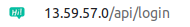

### mini_chat_grupal
Mini chat to connect with work teams and talk about projects.

[Demo](http://13.59.57.0/) -> Web Client

[API](http://13.59.57.0/api) -> Aplication interface, to manage DB

[Admin](http://13.59.57.0/api/login) -> To manage the Rooms

### Install and run the services

#### Requirements:
Install docker and docker-compose if you don't have it,
tested on Ubuntu 18.04.

- Docker
- docker-compose

#### Environment:

To build the container as a local build or as a fully contained service, you can override the next variables:

- API_URL : at [docker-compose.prod.yml](docker-compose.prod.yml) modify this variable to specify the domain you need, this variable affects the calls to the API from the django templates.
```
backend:
    build:
      context: ./backend
      dockerfile: ./Dockerfile
    ports:
      - 8000:8000
    depends_on:
      - db
    environment:
#       - API_URL=http://localhost:8000/api # Commented line --
       - API_URL=http://13.59.57.0/api
```

- REACT_APP_API_URL : at [frontend/minichat/.env](frontend/minichat/.env), affects the calls from the React Web Client to the API.

```
REACT_APP_API_URL=http://13.59.57.0/api
# REACT_APP_API_URL=http://localhost/api
```

- DB variables:

	Change this variables at the docker-compose files
	- POSTGRES_USER
	- POSTGRES_PASSWORD
	- POSTGRES_DB

#### All setted?, let's build

```
# To start the services from scratch RUN

$ sudo docker-compose up --build

# If you want to use a sql dump file dump file
# use the utility at the root of the project 'run_from_dump.sh'
# grab the dump.sql file to the root of the project, and then ...

$ sudo ./run_from_dump.sh
-----------------------------------------------------------
-- Start creating services from dump file 'dumpfile.sql' --
-----------------------------------------------------------
```

The services should be running at [localhost:3000](http://localhost:300) for the frontend service and [localhost:8000](http://localhost:8000) for the backend service.

### DB Backup

To backup the DB, open the db docker container and run the "pg_dump" command.

```
# Get the db container name
$ sudo docker ps

STATUS            NAMES                         PORTS                                      
Up 14 minutes     minichatgrupal_nginx_1        0.0.0.0:80->80/tcp, 0.0.0.0:443->443/tcp   
Up 14 minutes     minichatgrupal_frontend_1     0.0.0.0:3000->3000/tcp                     
Up 14 minutes     minichatgrupal_backend_1      0.0.0.0:8000->8000/tcp                     
Up 14 minutes     minichatgrupal_db_1           5432/tcp                                   

$ sudo docker exec -it minichatgrupal_db_1 bash

bash-5.0# pg_dump -h localhost -U mini_chat_dev -Fc mini_chat_dev_db > /home/dump.sql

# Exit the container

bash-5.0# exit

# Then copy the dump.sql file
# from the container to the actual directory "."

$ sudo docker cp minichatgrupal_db_1:/home/dump.sql .
$ ls
README.md  docker-compose.prod.yml  dump.sql  nginx
backend    docker-compose.yml       frontend
```

### Screenshots

Open your browser and search for any of the following according to your setup.


Login as the default superuser admin, check the value and edited as you need [backend/mini_chat/api/management/commands/initadmin.py](backend/mini_chat/api/management/commands/initadmin.py)

Also you can click "I don't have an account" to create a new user.


At the main view you can join any Active room.


### Change your avatar

Click the tool above the username.


Select the new picture


And click save to upload the new avatar.


You can delete your own messages


### Admin server

Go to the api Frontend.

 

After Login the page is loaded dynamically, and the location will be replaced to [/api/dashboard](http://localhost:8000/api/dashboard), the reason why this is dinamically is to allow just Authorized users to access the tool, so if you try a refresh on the page, the API server will throw you back the next message.


Then, just go back to login, and sign in again.


Now you can create, delete, and rename rooms


Author
------

Daniel Rodriguez Castillo 

[@Danucas](https://github.com/Danucas)


